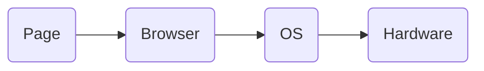

# Introduction

Hey! <br />
Here starts your journey on learning to make Progressive Web Apps!

## What are Progressive Web Apps?

I thought I could just find an article explaining what they are and link them here and that would be the end of that. But apparently people have trouble explaining what they are, and I mostly ran across meta-articles explaining [why it's hard to explain what progressive web apps are](https://medium.com/@amberleyjohanna/seriously-though-what-is-a-progressive-web-app-56130600a093) 😆.

I guess I'll have to write about it myself.

I think most people know what 'apps' are, they're short for applications, and that OS's like `Windows`, `Android`, `iOS`, `Mac`, etc. have apps, which you can use to do something.

For instance, I can use the `Snapchat` app to send pictures or videos to someone, or the `Instagram` app to share pictures. We also all seem to intuitively understand that an developer has to develop an app for each platform (`Android`, `iOS`, etc.) for us to be able to use those apps on those platforms.

For instance, one cannot install `iMessage` on Android, no matter how determined one is to do so, and many of us also understand why that is so, although some don't. I will try to explain that as well.

You see, people write applications by writing code, or by programming, and telling the Operating System what to do, or what was done, which in turn tells the processing units in your device what to do, and then things happen!

For instance, on this page, write this in this code -

```js
document.getElementById('what-are-progressive-web-apps').style.color = "yellow"
```

What it would do is that it would tell the browser to change the color of the text of the heading for this section to yellow, and then the browser would communicate this to the Operating system, and then the Operating System would co-ordinate with the hardware in your device attempting to bring about this change and eventually, the color would change.


